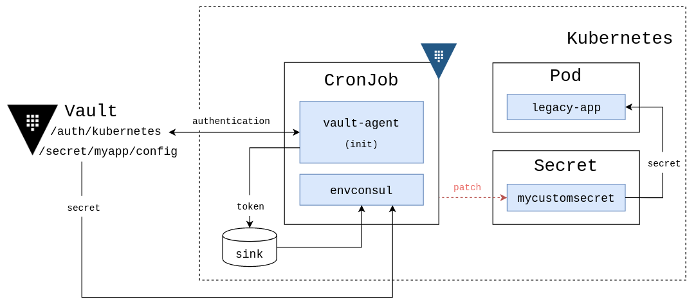

# Update Kubernetes Secrets from Vault

Updating a Kubernetes Secret via Cronjob

> Warning: don't do this, write proper apps

(helped me to learn about service accounts and roles in Kubernetes)



```bash

# proxy the Kubernetes api, Vault needs to talk to your minikube instance
kubectl proxy --address=0.0.0.0 --accept-hosts='.*'

# access the docker images on the minikube instance
eval $(minikube -p minikube docker-env)

# build a Docker image
docker build -t legacy-app:latest legacy-app
docker build -t envconsul:latest envconsul

# update configmaps
#kubectl delete configmap scripts
kubectl create configmap scripts --from-file=scripts
#kubectl delete configmap hcl-config
kubectl create configmap hcl-config --from-file=hcl-config
# create static Kubernetes secret
#kubectl delete secret mycustomsecret
kubectl create secret generic mycustomsecret --from-literal=key=customValue
kubectl get secret mycustomsecret -ojson | jq -r .data.key | base64 -d
# remember this secret value

# prepare service account to authenticate with Vault
# (https://www.vaultproject.io/docs/auth/kubernetes.html#configuring-kubernetes)
# and to patch the Kubernetes secrets
kubectl create -f vault-auth-service-account.yml
kubectl create -f example-vault-kubernetes.yml

# check out the new secret from Vault, this changes instantly after the cronjob was run the first time
kubectl get secret mycustomsecret -ojson | jq -r .data.key | base64 -d

# mounted secrets are updated automatically after some time (cache)
# https://kubernetes.io/docs/concepts/configuration/secret/#mounted-secrets-are-updated-automatically
kubectl exec deploy/example-vault-kubernetes cat /etc/secrets/key

# secrets as enviornment variables are never updated
kubectl exec deploy/example-vault-kubernetes printenv key

# the app is still using the old secret
kubectl logs deploy/example-vault-kubernetes --follow

# but we build stateless, right? kill the pod
# (use a rolling update strategy for production use)
kubectl get pod -l run=example-vault-kubernetes -L run
kubectl delete pod -l run=example-vault-kubernetes

# now the environment is updated as well
kubectl get pod -l run=example-vault-kubernetes -L run
kubectl logs deploy/example-vault-kubernetes --follow
kubectl exec deploy/example-vault-kubernetes printenv key
```
